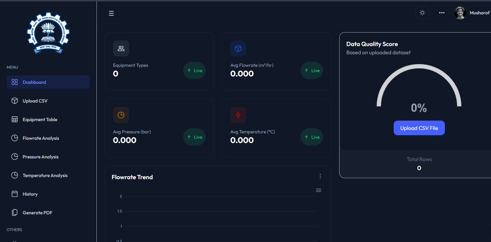

<p align="center">
  
</p>

<h1 align="center">🔬 IIT Bombay – Chemical Equipment Parameter Visualizer</h1>
<p align="center"><b>Hybrid Web + Desktop Application (React + Django + PyQt + Tailwind CSS)</b></p>

<p align="center">
  
  
  
  
  
</p>

---

## 📸 Project Screenshot

<p align="center">
  
</p>

---

## 📘 Overview

The **Chemical Equipment Parameter Visualizer** is a complete data analytics and visualization system built as part of the **IIT Bombay AI/ML Program**.  
It supports **both Web and Desktop versions**, providing seamless access for chemical engineers and researchers.

Users can upload CSV datasets, visualize equipment behavior, view statistical summaries, and analyze flowrate, pressure, and temperature trends.

---

## 📊 Features

### ✔ CSV Upload (Chemical Engineering Dataset)
Upload files containing:
- Flowrate  
- Pressure  
- Temperature  
- Timestamp  
- Equipment Type  

Automatic data cleaning + validation.

---

### ✔ Real-Time Summary Statistics
Includes:
- Total & valid rows  
- Missing/invalid entries  
- Mean values of parameters  
- Equipment type distribution  

---

### ✔ Data Quality Score (Radial Gauge)
Instant calculation of dataset quality based on missing/invalid records.

---

### ✔ Monthly Trend Analytics
Interactive charts using **ApexCharts**:
- 📈 Monthly Flowrate  
- 🌡 Monthly Temperature  
- ⚙ Monthly Pressure  

Each analysis has a dedicated navigation page.

---

### ✔ IIT Bombay Branding
- Institute logo  
- Custom sidebar  
- Clean dark/light mode  
- TailAdmin template fully customized  

---

### ✔ Hybrid Deployment
- 🌐 Full Web App (React + Vite + Tailwind)
- 🖥️ Full Desktop App (PyQt5 + WebEngineView)
- 🧠 Shared Django REST API backend

---

## 🧰 Tech Stack

### **Frontend**
- React 19  
- TypeScript  
- Tailwind CSS  
- ApexCharts  
- Zustand  
- Vite  

### **Backend**
- Django  
- Django REST Framework  
- Pandas  
- SQLite  

### **Desktop**
- PyQt5  
- Qt WebEngine (loads React UI natively)

---

## 🚀 Getting Started

### 🎨 Frontend Setup (React + Vite + Tailwind CSS)

```bash
cd frontend

# Create a venv for frontend (optional but requested)
python -m venv venv

# Activate environment
venv\Scripts\activate     # Windows

# Install Node dependencies inside activated environment
npm install

# Start the development server
npm run dev
```

Frontend runs at:  
👉 http://localhost:5173/


### 🔧 Backend Setup (Django)

```bash
cd backend

# Create backend virtual environment
python -m venv venv

# Activate the environment
venv\Scripts\activate     # Windows

# Install backend dependencies
pip install -r requirements.txt
pip install reportlab     # required for PDF generation

# Run backend server
python manage.py migrate
python manage.py runserver
```

Backend runs at:  
👉 http://127.0.0.1:8000/


### 🖥️ Desktop Setup (PyQt5 + Matplotlib + Requests)

```bash
cd desktop

# Create desktop virtual environment
python -m venv venv

# Activate the environment
venv\Scripts\activate     # Windows

# Install desktop dependencies
pip install PyQt5 PyQtWebEngine matplotlib requests

# Install reportlab if your PyQt app uses PDF generation
pip install reportlab

# Run the desktop application
python main.py
```


